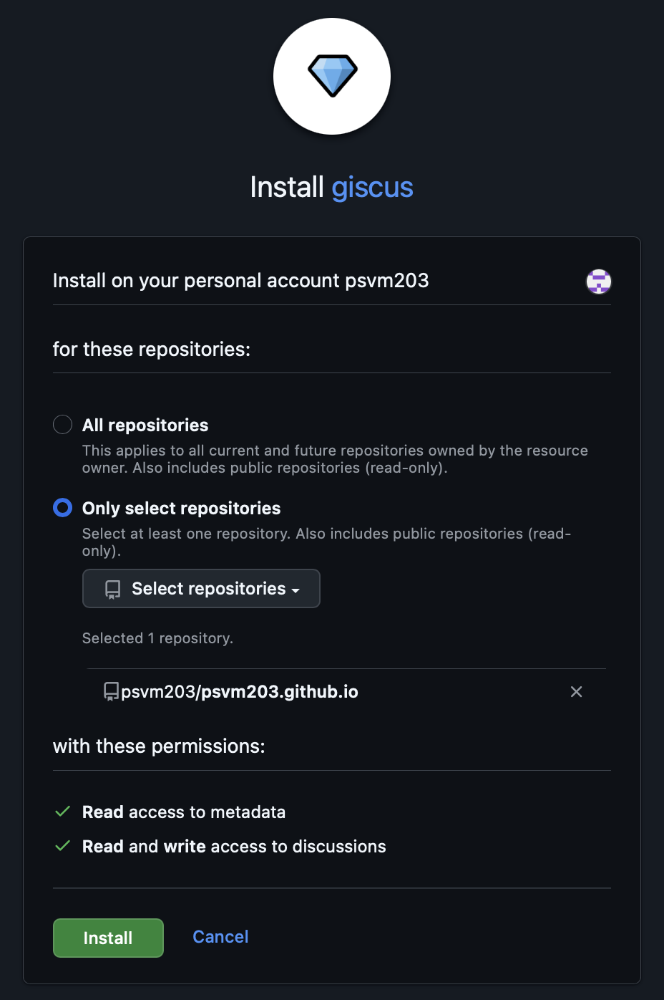
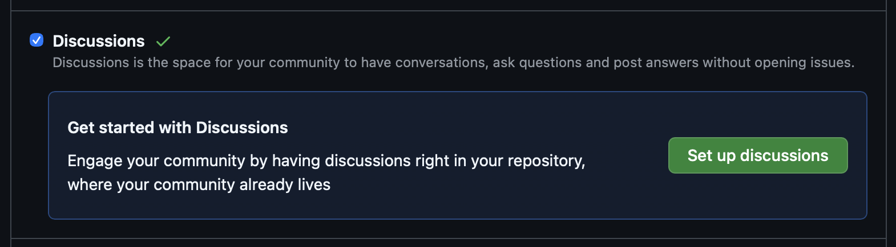
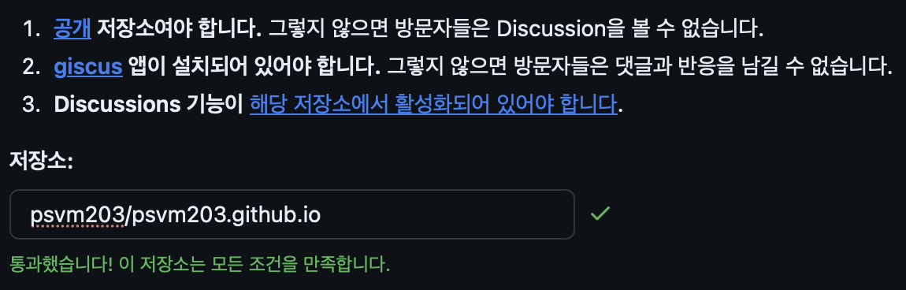
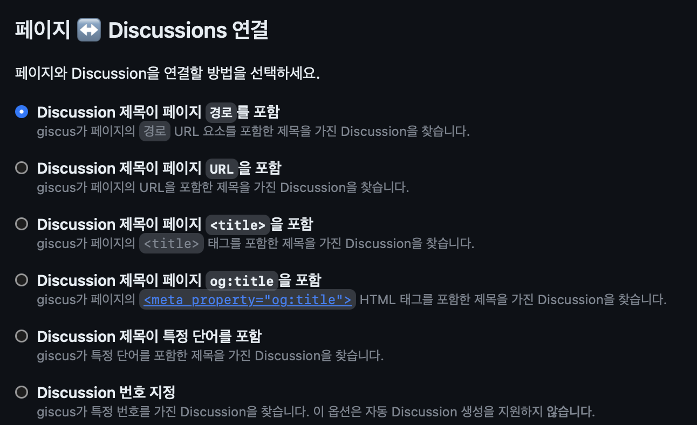
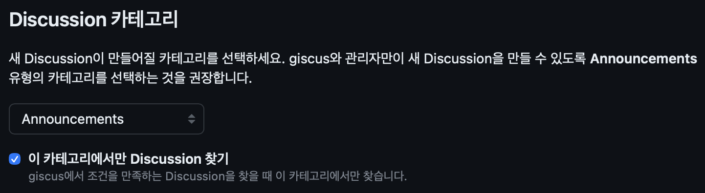
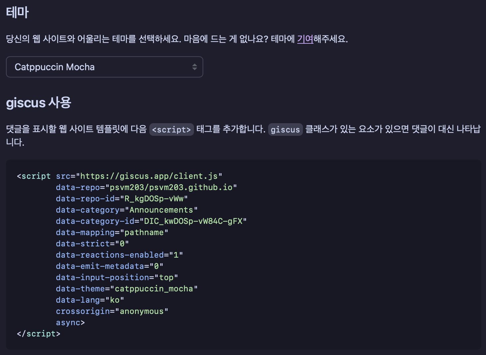
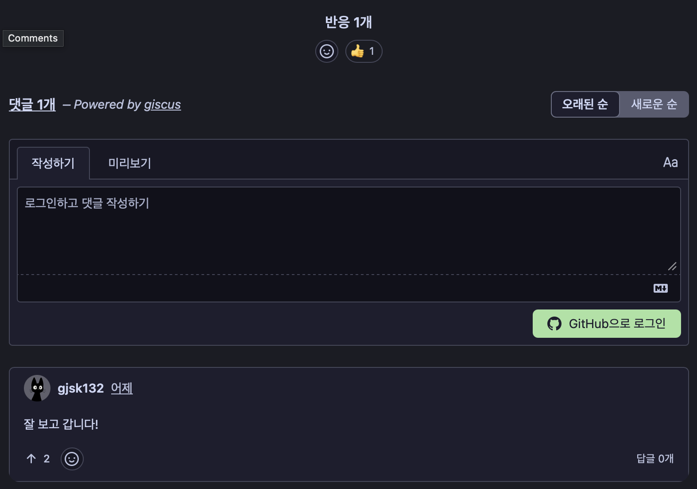

## 댓글 시스템 비교

### Disqus

[Disqus](https://disqus.com)는 웹 사이트에 손쉽게 댓글 기능을 추가할 수 있는 플랫폼이다. 코드 몇 줄만 넣으면 댓글 시스템을 추가할 수 있어 블로그 같은 정적 사이트에 많이 쓰인다.

다만 무료 플랜에서는 광고가 삽입되고 방문자 데이터가 수집된다는 단점이 있다. 이를 대체하고자 등장한 것이 utterances다.

### utterances

[utterances](https://github.com/utterance/utterances)는 깃허브 issues를 사용하는 댓글 시스템이다.

> - [Open source](https://github.com/utterance). 🙌
> - No tracking, no ads, always free. 📡🚫
> - No lock-in. All data stored in GitHub issues. 🔓

다분히 Disqus를 저격하는 듯한 설명이 눈에 띈다.

### giscus

[giscus](https://github.com/giscus/giscus)는 utterances에서 영감을 받은 댓글 시스템이다. 깃허브 Issues 대신 Discussions를 기반으로 작동한다.

Issues는 본래 버그 리포트나 작업 관리를 위한 기능이다. 이를 댓글 용도로 쓰면 레포지토리의 Issues 목록이 댓글로 가득 차 본래 목적을 살리기 어려워진다. 반면 Discussions는 대화를 위한 기능이라 용도에 더 잘 맞으며, 반응이나 중첩 답글처럼 댓글 시스템에 적합한 기능도 제공한다.

## giscus 설치하기

### giscus 앱 추가

https://github.com/apps/giscus 에 접속해 giscus 깃허브 앱을 설치하고, 댓글 시스템을 적용할 레포지토리로 설정한다.

### 깃허브 Discussions 활성화

깃허브 레포지토리 설정에 들어가 Discussions를 활성화한다.

 

https://giscus.app/ko 에서 저장소 이름을 입력하면 체크 표시가 나오는 걸 확인할 수 있다.

### Discussions 연결 옵션

블로그 글과 Discussions의 제목을 어떻게 연결할지 설정할 수 있다.

블로그 글의 URL이 https://psvm203.github.io/posts/blog-comments 라면, 각 옵션의 Discussion의 제목은

- 페이지 경로: `posts/blog-comments`
  - http가 https로 바뀌거나 origin이 바뀌어도 인식한다.
  - 가장 추천하는 방식이다.

- 페이지 URL: `https://psvm203.github.io/posts/blog-comments`
  - http가 https로 바뀌거나 origin이 바뀌면 다른 Discussions가 생성된다.

- 페이지 title(og:title): `깃허브 블로그 방문자 통계 확인하기 - psvm203`
  - 제목이 수정되면 다른 Discussions가 생성된다.

### Discussions 카테고리

카테고리는 Announcements로 설정한다. 다른 카테고리는 방문자가 Discussions를 생성할 수 있어 오염될 우려가 있다.

### 적용하기

원하는 테마를 고르고, 생성된 소스 코드를 댓글을 넣고 싶은 위치에 붙여넣으면 댓글 시스템이 적용된다.

 

위는 Giscus를 적용한 예시이다.
