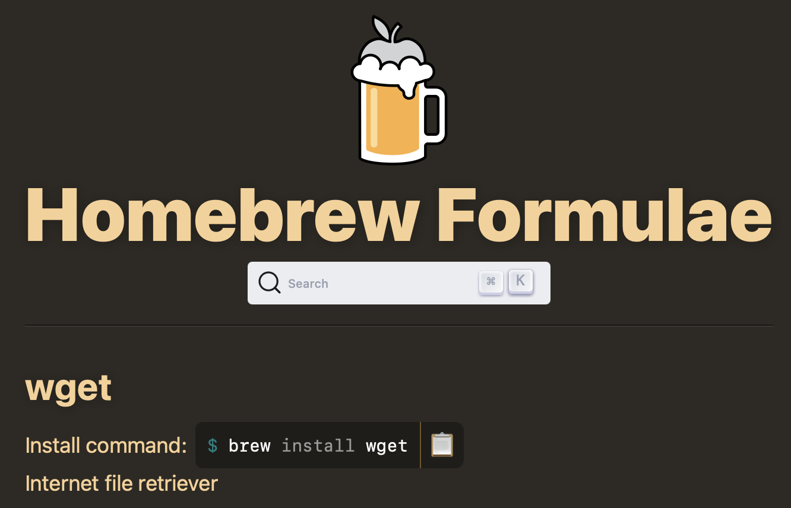

## Homebrew란?

Homebrew는 macOS용 서드파티 패키지 관리자로, 터미널에서 프로그램을 설치, 삭제, 업데이트할 수 있다. macOS에는 윈도우의 `winget`이나 리눅스의 `apt` 같은 공식 패키지 관리자가 없어 Homebrew가 그 역할을 대신한다.

웹사이트를 일일이 찾아다니며 `.dmg` 파일을 내려받고, 마운트하고, 옮기고, 언마운트하는 번거로운 과정을 명령어 한 줄로 줄여준다. 또한 `.dmg` 파일로 설치한 프로그램은 하나씩 직접 실행해서 업데이트해야 하지만, Homebrew를 쓰면 설치된 모든 프로그램을 명령어 한 줄로 한 번에 업데이트할 수 있다.

이처럼 Homebrew는 흩어져있는 번거로운 프로그램 관리 작업을 터미널 하나로 깔끔하게 모아준다. 한번 익숙해지면 다시는 `.dmg` 파일을 보고 싶지 않아질 만큼 편리하다. 이제 Homebrew를 설치하는 방법과 사용법을 알아보자.

## Homebrew 설치 방법

아래 명령어로 설치할 수 있다.

```shell
/bin/bash -c "$(curl -fsSL https://raw.githubusercontent.com/Homebrew/install/HEAD/install.sh)"
```

## 프로그램 설치

`brew install {프로그램 이름}` 을 입력하면 된다. 프로그램 이름은 구글에 `brew {설치할 프로그램}` 을 검색하면 Homebrew 웹 페이지에 나온다.



```shell
brew install wget
```

<br />

GUI 프로그램의 경우, `--cask` 옵션을 사용해야 하지만 생략해도 작동한다.

```shell
brew install --cask visual-studio-code
```

<br />

`brew info`로 설치 없이 정보만 확인할 수도 있다.

```shell
brew info visual-studio-code
```

<br />

`brew list`로 설치된 프로그램 목록을 확인할 수 있다.

```shell
brew list
```

## 프로그램 삭제

`brew uninstall {프로그램 이름}` 을 입력하면 된다.

```shell
brew uninstall wget
```

<br />

GUI 프로그램의 경우 `--zap` 옵션을 사용하면 프로그램이 남긴 설정 파일, 데이터 같은 잔여 파일까지 삭제하므로 `brew uninstall --zap`으로 삭제하는 걸 추천한다.

```shell
brew uninstall --zap visual-studio-code
```

## 프로그램 정리

`brew autoremove`는 어떤 프로그램도 의존하지 않는 프로그램, 즉 더 이상 필요 없어진 프로그램을 삭제하고, `brew cleanup`은 오래된 버전의 패키지, 캐시, 임시 파일을 삭제한다. 주기적으로 실행하면 용량 관리에 도움이 된다.

```shell
brew autoremove
brew cleanup
```

## 프로그램 업데이트

`brew update`를 하면 프로그램 정보(카탈로그)를 최신 상태로 업데이트한다. 이름과는 달리 프로그램을 업데이트하지는 않는다. 다른 `brew` 명령 실행 시 자동으로 갱신되는 경우가 많으므로 직접 실행하지 않아도 괜찮다.

```shell
brew update
```

<br />

`brew upgrade`를 하면 `brew`로 설치한 모든 프로그램을 최신 상태로 업그레이드한다.

```shell
brew upgrade
```

<br />

특정 프로그램만 업그레이드하고 싶으면 프로그램 이름을 붙이면 된다.

```shell
brew upgrade visual-studio-code
```

<br />

`brew pin`으로 특정 프로그램의 버전을 고정, 즉 업그레이드를 방지할 수 있다. 단, `brew upgrade`만 방지되므로 GUI 프로그램의 자체 업데이트는 가능하다. `brew unpin`으로 해제할 수 있다.

```shell
brew pin visual-studio-code
brew unpin visual-studio-code
```

## 여담: --cask 옵션

GUI 프로그램을 설치, 삭제, 업그레이드할 때는 `--cask` 옵션을 사용해야 한다.

`--cask` 옵션을 붙이지 않으면 CLI 프로그램(formula)을 우선적으로 검색하고, 붙이면 GUI 프로그램(cask)만을 찾는다.

다만 이름이 같은 CLI/GUI 프로그램은 이 글을 작성하는 시점에서 존재하지 않으므로 (`docker`은 겹친 적이 있으나 이름을 바꾸었다.) 대부분의 경우 `--cask` 옵션을 생략해도 된다. 명확성을 위해서는 명시하는 것이 좋다.
