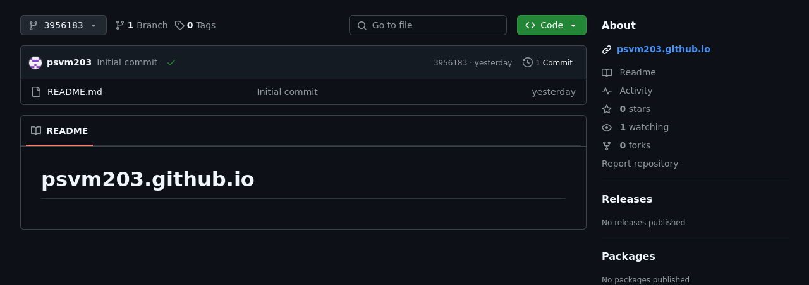
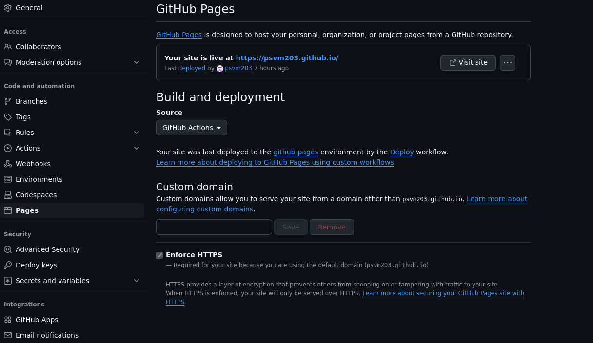

# mdBook으로 블로그 만들기 1

mdBook으로 블로그를 만들고, Github Pages에 호스팅하는 방법에 대해 알아보자.

## mdBook이란?

[mdBook](https://github.com/rust-lang/mdBook)은 마크다운 파일을 기반으로 웹 페이지를 생성하는 오픈소스 프로그램이다.

[Gitbook](https://www.gitbook.com)과 유사하나 Rust로 개발되어 속도와 안정성 면에서 장점이 있다.

## 리포지토리 생성



먼저, 깃허브에 ***{사용자 이름}*.github.io** 라는 이름으로 리포지토리를 생성한다.

```sh
git clone https://github.com/{사용자 이름}/{사용자 이름}.github.io
```

그 후, 원하는 위치에 리포지토리를 클론한다.

## mdBook 설치

총 3가지 방법이 있으며, 나는 첫 번째 방법으로 진행했다.

<br>

```sh
cargo add mdbook
```

위 명령으로 [crates.io](https://crates.io)에서 mdBook 크레이트를 다운로드 및 빌드할 수 있다.

---

```sh
cargo install --git https://github.com/rust-lang/mdBook.git mdbook
```

그런데 crates.io에 배포된 버전은 깃허브 최신 버전보다 낮을 수 있으므로, 문자 그대로의 최신 버전을 원한다면 [깃허브](https://github.com/rust-lang/mdBook)에서 다운로드하여 설치할 수 있다.

---

또는 [미리 컴파일된 바이너리](https://github.com/rust-lang/mdBook/releases)를 다운로드하여 사용하는 방법도 있다. 이 방법은 가장 빠르지만, 직접 `PATH`에 추가해야 하는 단점이 있다.

## mdBook 생성

```sh
mdbook init {사용자 이름}.github.io
```

클론한 리포지토리의 상위 폴더에서 위 명령을 실행한다.

실행 시 "Do you want a .gitignore to be created?" 라는 질문이 나오는데, 이는 빌드한 결과물이 들어있는 폴더를 .gitignore에 추가할지 물어보는 옵션이므로 y를 입력한다.

<br>

```sh
cd {사용자 이름}.github.io
```

```sh
mdbook serve -o
```


폴더 내부로 이동한 후, **`mdbook serve -o`** (또는 **`mdbook serve --open`**) 명령을 실행하면 빌드된 mdBook의 웹 페이지를 볼 수 있다.

이 웹 페이지는 내부 파일을 수정할 때마다 자동으로 다시 빌드된다.

## Github Pages에 호스팅

```yml
name: Deploy
on:
  push:
    branches:
      - main

jobs:
  deploy:
    runs-on: ubuntu-latest
    permissions:
      contents: write  # To push a branch 
      pages: write  # To push to a GitHub Pages site
      id-token: write # To update the deployment status
    steps:
      - uses: actions/checkout@v4
        with:
          fetch-depth: 0
      - name: Install latest mdbook
        run: |
          tag=$(curl 'https://api.github.com/repos/rust-lang/mdbook/releases/latest' | jq -r '.tag_name')
          url="https://github.com/rust-lang/mdbook/releases/download/${tag}/mdbook-${tag}-x86_64-unknown-linux-gnu.tar.gz"
          mkdir mdbook
          curl -sSL $url | tar -xz --directory=./mdbook
          echo `pwd`/mdbook >> $GITHUB_PATH
      - name: Build Book
        run: |
          # This assumes your book is in the root of your repository.
          # Just add a `cd` here if you need to change to another directory.
          mdbook build
      - name: Setup Pages
        uses: actions/configure-pages@v4
      - name: Upload artifact
        uses: actions/upload-pages-artifact@v3
        with:
          # Upload entire repository
          path: 'book'
      - name: Deploy to GitHub Pages
        id: deployment
        uses: actions/deploy-pages@v4
```

위 내용을 복사하여 ***{사용자 이름}*.github.io/.github/workflows/deploy.yml** 으로 저장한 후 푸시한다.

<br>



그 다음, 깃허브의 Settings > Pages > Build and deployment > Source를 **Github Actions**로 바꾸어주면 된다.

## 참고 자료

[https://pages.github.com](https://pages.github.com)

[https://rust-lang.github.io/mdBook](https://rust-lang.github.io/mdBook)

[https://github.com/rust-lang/mdBook/wiki/Automated-Deployment%3A-GitHub-Actions](https://github.com/rust-lang/mdBook/wiki/Automated-Deployment%3A-GitHub-Actions)
